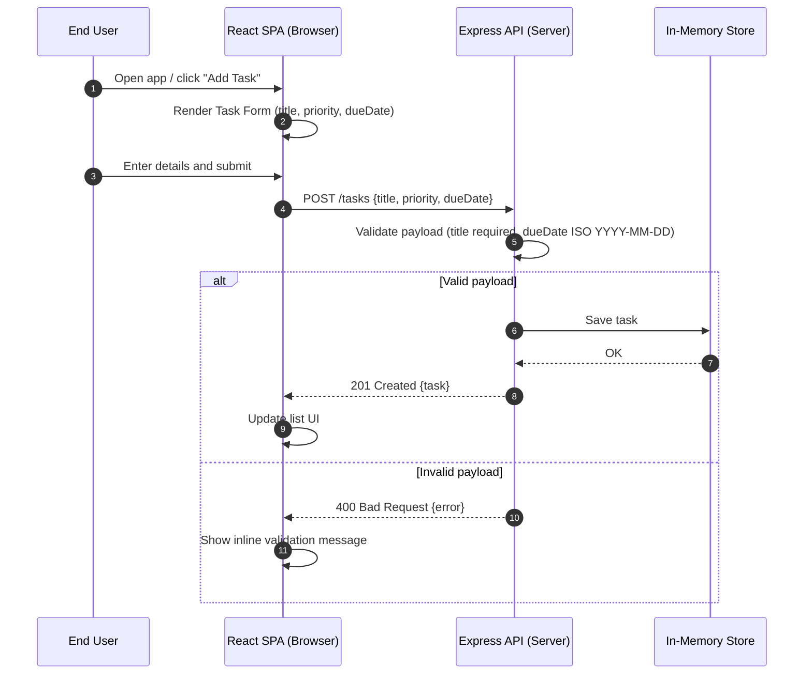

# Cloud Architecture Overview

A simple system context diagram for the monorepo: React frontend, Express API, and an in-memory data store.

```mermaid
flowchart TB
    %% Actors
    user[End User]

    %% Client
    subgraph Client (Browser)
        frontend[React SPA (packages/frontend)]
    end

    %% Server
    subgraph Server (Node.js)
        api[Express API Server (packages/backend)]
        store[(In-Memory Data Store)]
    end

    %% Flows
    user --> frontend
    frontend --> api
    api --> store

    %% Notes
    %% - Frontend runs in the browser
    %% - Backend runs in Node.js and uses in-memory storage
    %% - Data persists only for the life of the process
```

## Sequence: Create a TODO


